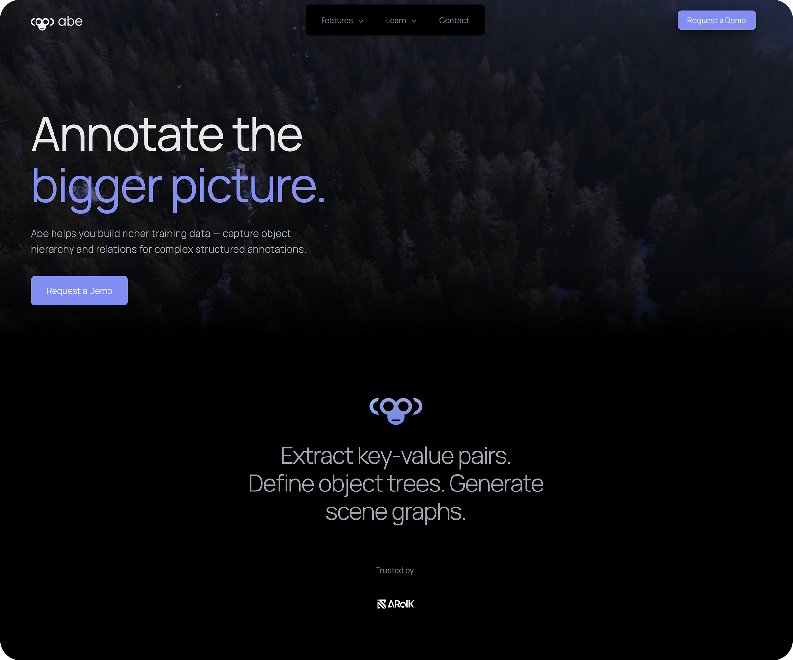

## Abe - Collaborative Data Annotator
Annotate the bigger picture. Abe helps you build richer training data — capture object hierarchy and relations for complex structured annotations.
a machine learning . .  👉 [View Site](https://site-template-v2.vercel.app)

 

## Known issues:
- Drag & Drop of Annotation Tree panel

## Planned:
- Support for drawing vector shapes (currently limited to rectangles)
- Support for auto-generation of shapes from user selections.
- Auto-annotation based on active learning
- 
 

