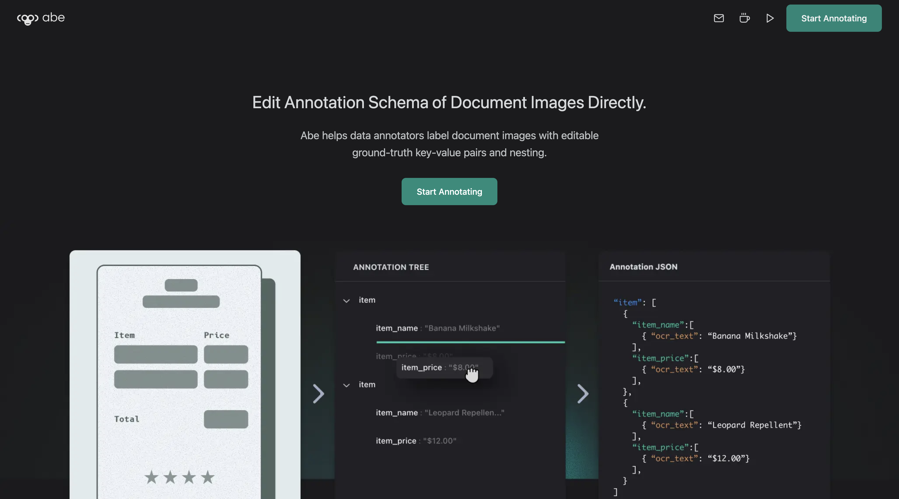

# Abe 

 

Abe is a ground-truth schema editor for document images. It lets data annotators adjust key-value pairs, nesting, and ordering directly, then export JSON that’s ready for model training.
 👉 [Try it](https://abe-annotator.vercel.app/)

 

### Challenges:
- Existing tools handle classical tasks like object detection but fail for structured key-value extraction in document parsing.
- In practice, data schemas evolve and are continually discovered by labelers — not fixed upfront. These need to be reconciled and consolidated.

 

 

