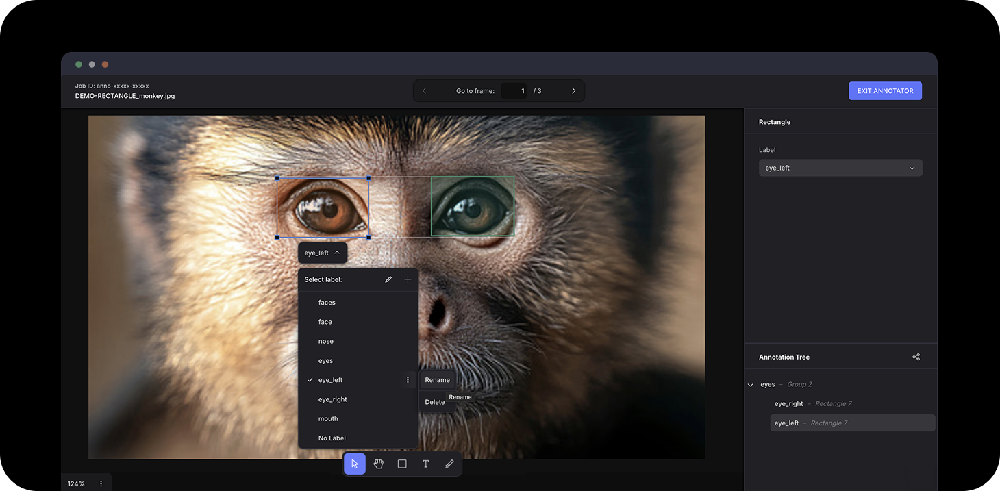

# Abe - Annotate the Bigger Picture

 

Abe is an image data annotator for complex object relations. It helps you build richer training data — capture object hierarchy and relations, while managing evolving data schema. 👉 [Request a Demo](https://abe-branding.vercel.app/)

 

### Challenges:
- Existing tools handle classical tasks like object detection but fail for structured key-value extraction in document parsing.
- In practice, data schemas evolve and are continually discovered by labelers — not fixed upfront. These need to be reconciled and consolidated.

 

 

## Known bugs:
- Drag & Drop of Annotation Tree panel

## Planned:
- Scene graphs
- Semi-automated schema reconciliation

 

