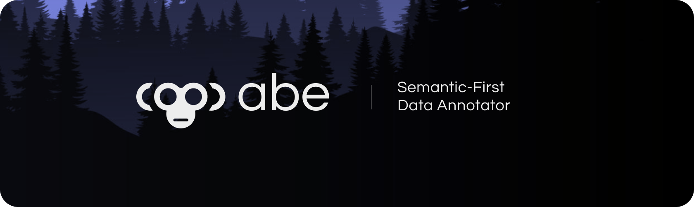

## Abe Website
I'm currently working on Abe, a machine learning platform that slashes labeling time with active learning. This repo is its WIP website – simple, responsive, built with React, TypeScript, and Tailwind CSS.  
👉 [View Site](https://site-template-v2-git-main-james-projects-31877320.vercel.app/)

 

## Current scope: 
Homepage design & frontend development: I focus on responsiveness across various screen sizes.  

 

